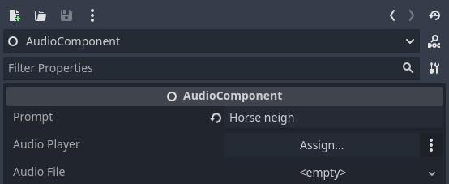
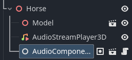

# What is this?
This is a silly little project where I use AudioGen (from https://github.com/facebookresearch/audiocraft) to generate SFX in real time in a simple demo scene in Godot (4.2.1). I didn't have any expectations regarding the usefulness of such implementation, and was expecting some weird and funny stuff to come out (and I was right!). I did however realize that this *could* actually be useful for non-visible, distant things like birds high up in the sky, or in dense treetops - filler sounds, if you will. All you do is provide a prompt, and when the process is complete, you click the object in the scene you want to make funny noises and it makes funny noises.

The setup is quite simple; I created a simple dummy-API using Flask which took a already created audio file, renamed it to whatever request was being made, then returned the "generated" audio file on a GET request. This was only done because I didn't have access to a powerful enough GPU at the time, so I had to emulate the desired functionality. The code I used for the real deal is called `example_using_audiogen.py`.
  
In Godot, I wanted to follow the native pattern and have a separate component to put on things you want to make noise; the AudioComponent. The AudioComponent only requires a prompt; what the AI-model will use to generate audio (text-to-audio), and a AudioStreamPlayer where the sound will be played. When the "game" starts, every AudioComponent is collected and their prompts are sent to the API (HTTP) for the model to start generating, and once that's done, a signal fires telling the components to start the GET request and download + assign them to their source. The process could be triggered any time while the game is running, I just kept it like this for whatever reason.
 
 
&nbsp;
 
 
# Can I try it locally?
Yes, if you have a GPU with 16 GB VRAM available for AudioGen (it fit on 12 GB, but 16 is their recommendation), just follow their guide to set up the env. Else you could simply use the dummy-API, but that's no fun. It's nothing more than a super basic API running on localhost to where the "game" makes HTTP requests to "generate" and download audio.
 
 
# Assets in Godot
Walk in the Woods by Don Carson [CC-BY] via Poly Pizza 
Giraffe by Poly by Google [CC-BY] via Poly Pizza 
Horse by Poly by Google [CC-BY] via Poly Pizza 
Duck by jeremy [CC-BY] via Poly Pizza 
 
